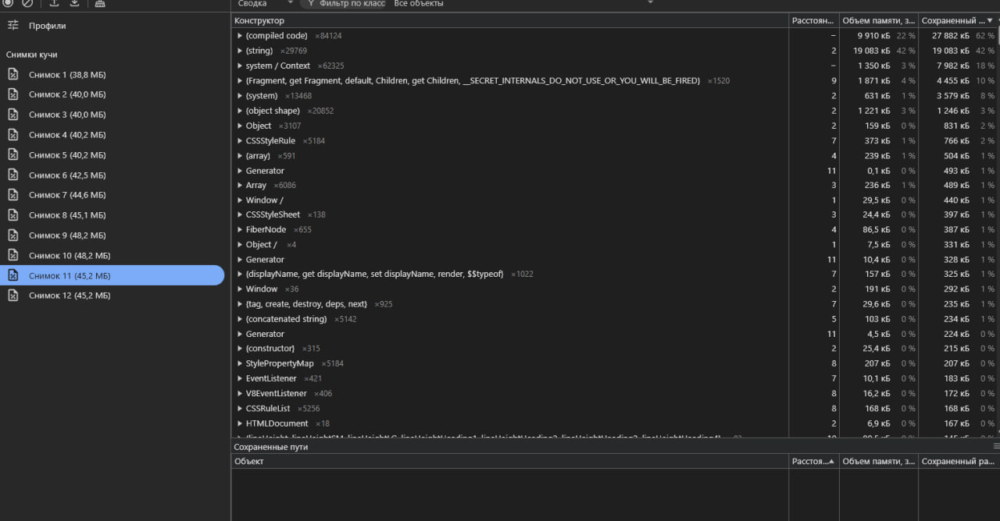
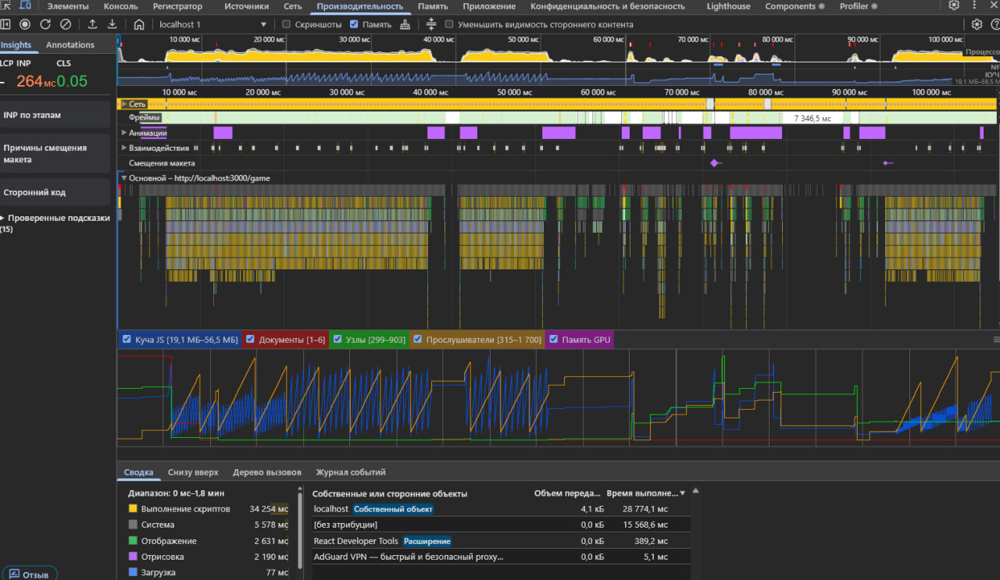

# MEMORY LEAKS

> Обновлено: 31.08.2025

---

## Методика проверки

Проверки проводятся вручную через **Chrome DevTools**:

- Вкладка **Memory**, скриншоты (Heap size).
- Дополнительно выполнена запись во вкладке **Performance** с включённой галочкой «Memory».
- Прогоняются основные сценарии: запуск/остановка игры, переход по вкладкам (форум, лидерборд), работа с формами (добавление топика), обновление данных.
- Сравнивается размер кучи до/после действий. Если нет монотонного роста — утечек нет.

---

## Результаты проверки (2025-08-31)

### Сценарий

1. Запуск игры (меню → старт → стоп → продолжить → стоп).
2. Переход на форум, добавление топика.
3. Переход на лидерборд, обновление списка.
4. Возврат в игру, запуск/остановка.

### Наблюдения (Chrome DevTools → Memory, Heap size)

- До игры: **38.8 МБ**
- Игра: ~**40.0–40.2 МБ**
- Форум: **42.5 МБ**
- Добавлен топик: **44.6 МБ**
- Лидерборд: **45.1 → 48.2 МБ** (при обновлении)
- Возврат в игру: **45.2 МБ**

### Дополнительно (Chrome DevTools → Performance, Memory)

- Проделаны те же действия при включённой записи памяти.
- Результаты повторились, график показывает отсутствие монотонного роста.

### Итог

- Рост памяти при навигации и загрузке данных ожидаем и нормален для работы приложения.
- После возврата в игру Heap стабилизировался (около 45 МБ).
- Проверка через **Memory** и **Performance** показала одинаковый результат.
- **Монотонного роста не обнаружено → утечек памяти не зафиксировано.**
