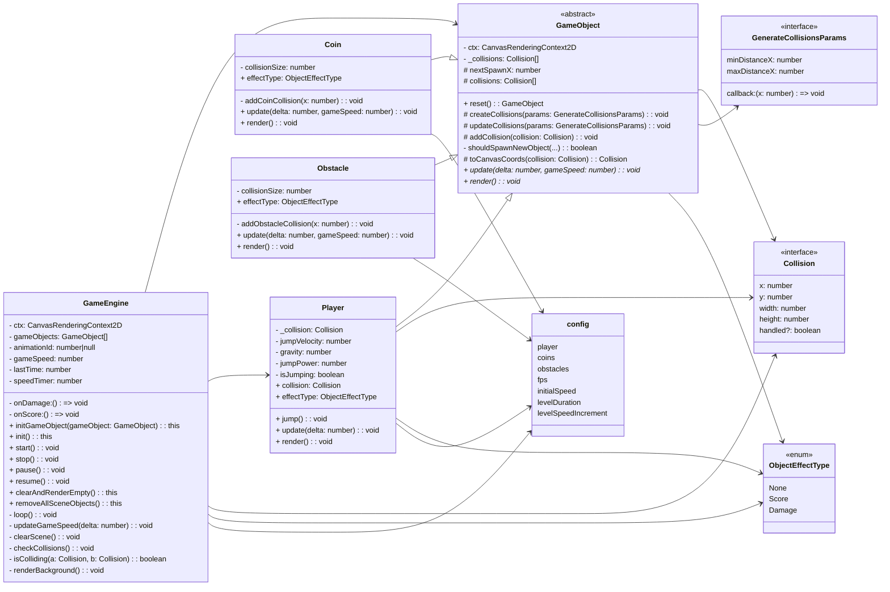

# Игровой движок

- [UML диаграмма](#uml-диаграмма)
- [GameEngine](#gameengine)
- [GameObject](#gameobject)
- [Player](#player)
- [Coin](#coin)
- [Obstacle](#obstacle)
- [Конфигурация игры](#конфигурация-игры)
- [Типы и перечисления](#типы-и-перечисления)

## UML диаграмма



## Базовые классы

### GameEngine

#### Общее описание

`GameEngine` — основной класс, отвечающий за управление игровым циклом, рендеринг, обновление объектов и проверку столкновений. Управляет состоянием игры (запуск, остановка, пауза, продолжение) и логикой обработки эффектов (например, начисление очков или получение урона).

#### Конструктор

```ts
constructor(props: {
  ctx: CanvasRenderingContext2D;
  onDamage: () => void;
  onScore: () => void;
})
```

#### Свойства

| Название | Описание                                        |
| -------- | ----------------------------------------------- |
| ctx      | Возвращает контекст канваса.                    |
| onDamage | Колбэк, вызываемый при получении урона игроком. |
| onScore  | Колбэк, вызываемый при получении очков.         |

#### Публичные методы

| Название                                     | Описание                                                                     |
| -------------------------------------------- | ---------------------------------------------------------------------------- |
| initGameObject(gameObject: GameObject): this | Добавляет объект на сцену.                                                   |
| init(): this                                 | Инициализирует движок. Пока заглушка.                                        |
| start(): void                                | Запускает игровой цикл. Если уже запущен — выводит предупреждение в консоль. |
| stop(): void                                 | Полностью останавливает игровой цикл.                                        |
| pause(): void                                | Приостанавливает игровой цикл.                                               |
| resume(): void                               | Возобновляет игровой цикл после паузы.                                       |
| clearAndRenderEmpty(): this                  | Очищает канвас и возвращает экземпляр движка.                                |
| removeAllSceneObjects(): this                | Удаляет все объекты сцены.                                                   |

#### Приватные методы

| Название                                         | Описание                                                                                                                                                                    |
| ------------------------------------------------ | --------------------------------------------------------------------------------------------------------------------------------------------------------------------------- |
| loop(): void                                     | Основной игровой цикл: обновление объектов, отрисовка и проверка столкновений.                                                                                              |
| updateGameSpeed(delta: number): void             | Обновляет скорость игры с определённой периодичностью, согласно настройкам.                                                                                                 |
| clearScene(): void                               | Полностью очищает канвас.                                                                                                                                                   |
| checkCollisions(): void                          | Проверяет столкновения между игроком и другими объектами. В зависимости от `effectType` вызывает `onScore()` или `onDamage()`. Метод не удаляет объекты после столкновения. |
| isColliding(a: Collision, b: Collision): boolean | Проверяет пересечение двух объектов по их границам (AABB).                                                                                                                  |
| renderBackground(): void                         | Добавляет фон сцены.                                                                                                                                                        |

#### Используемые типы

- `GameObject`: Базовый класс для объектов сцены.
- `Player`: Представляет объект игрока.
- `Collision`: Определяет границы объекта для проверки столкновений.
- `ObjectEffectType`: Перечисление типов эффектов (`Score`, `Damage`).

#### Пример использования

```ts
const engine = new GameEngine({
  ctx: canvas.getContext('2d'),
  onDamage: () => console.log('Игрок получил урон!'),
  onScore: () => console.log('Игрок набрал очки!'),
});

engine.initGameObject(new Player()).initGameObject(new Coin()).init();
engine.start();
```

#### Примечания

- `GameEngine` ожидает, что каждый `GameObject` реализует методы `update(deltaTime, speed)` и `render()`.
- Скорость игры увеличивается со временем, повышая сложность.
- Проверка столкновений реализована через оси, выровненные по границам (AABB).

### GameObject

#### Общее описание

`GameObject` — абстрактный базовый класс для игровых объектов, предназначенных для рендеринга и взаимодействия на Canvas. Предоставляет базовую реализацию для работы с коллизиями, спавном и сбросом состояния.

Наследники должны реализовать методы `update()` и `render()`. Эти методы обязаны использовать this.\_collisions, чтобы синхронизировать логику рендера и взаимодействия.

#### Свойства

| Название                              | Описание                                                 |
| ------------------------------------- | -------------------------------------------------------- |
| ctx: CanvasRenderingContext2D         | Контекст канваса для отрисовки объектов.                 |
| \_collisions: Collision[]             | Массив текущих коллизий объекта.                         |
| nextSpawnX: number                    | Следующая координата по оси X для генерации объекта.     |
| abstract effectType: ObjectEffectType | Тип эффекта при столкновении (`Score`, `Damage` и т.д.). |

#### Геттеры

| Название                | Описание                            |
| ----------------------- | ----------------------------------- |
| collisions: Collision[] | Возвращает массив коллизий объекта. |

#### Публичные методы

| Название                                                | Описание                                                                      |
| ------------------------------------------------------- | ----------------------------------------------------------------------------- |
| reset(): this                                           | Сбрасывает внутреннее состояние объекта (коллизии и координату `nextSpawnX`). |
| abstract update(delta: number, gameSpeed: number): void | Обновляет состояние объекта. Должен быть реализован в наследниках.            |
| abstract render(): void                                 | Отрисовывает объект. Должен быть реализован в наследниках.                    |

#### Приватные методы

| Название                                                                                   | Описание                                                                             |
| ------------------------------------------------------------------------------------------ | ------------------------------------------------------------------------------------ |
| createCollisions({ minDistanceX, maxDistanceX, callback }: GenerateCollisionsParams): void | Генерирует коллизию с случайным отступом по оси X и вызывает `callback(nextSpawnX)`. |
| shouldSpawnNewObject({ last, minDistanceX, canvasRight }): boolean                         | Определяет, необходимо ли создать новый объект                                       |
| updateCollisions({ minDistanceX, maxDistanceX, callback }: GenerateCollisionsParams): void | Обновляет массив коллизий и инициирует создание новой, если необходимо.              |
| addCollision(collision: Collision): void                                                   | Добавляет коллизию в массив `_collisions`.                                           |
| toCanvasCoords(collision: Collision): Collision                                            | Преобразует координату Y в координату канваса (инвертирует ось).                     |

#### Используемые типы

- `Collision`: Интерфейс с координатами и размерами объекта (`x`, `y`, `width`, `height`).
- `GenerateCollisionsParams`: Параметры для генерации коллизий, включая `minDistanceX`, `maxDistanceX` и `callback`.
- `ObjectEffectType`: Тип эффекта от объекта (очки, урон и т.д.).

#### Примечания

- Базовый класс не предназначен для непосредственного использования. Используйте наследование для создания конкретных игровых объектов.
- Все координаты рассчитываются с учётом инверсии оси Y (Canvas имеет начало координат в левом верхнем углу).
- Метод `toCanvasCoords` может быть полезен при рендеринге объектов в нижней части экрана.

#### Пример использования

```ts
class Bonus extends GameObject {
  effectType = ObjectEffectType.Score;

  update(delta: number, gameSpeed: number) {
    const dx = gameSpeed * delta * 60;
    this._collisions.forEach((c) => (c.x -= dx));
  }

  render() {
    this.ctx.fillStyle = 'green';
    this._collisions.forEach((c) => {
      const { x, y, width, height } = this.toCanvasCoords(c);
      this.ctx.fillRect(x, y, width, height);
    });
  }
}
```

## Классы игровых объектов

### Player

#### Общее описание

`Player` — класс игрового объекта игрока. Наследуется от `GameObject` и реализует поведение, связанное с прыжками и гравитацией. Обновляет координаты в соответствии с физикой, отрисовывается на канвасе.

#### Свойства

| Название     | Описание                                                 |
| ------------ | -------------------------------------------------------- |
| \_collision  | Основная коллизия игрока.                                |
| jumpVelocity | Скорость прыжка (вверх или вниз).                        |
| gravity      | Гравитация, с которой игрок падает вниз.                 |
| jumpPower    | Сила, с которой игрок прыгает вверх.                     |
| isJumping    | Флаг, указывающий, находится ли игрок в прыжке.          |
| effectType   | Тип эффекта — для игрока всегда `ObjectEffectType.None`. |

#### Геттеры

| Название  | Описание                     |
| --------- | ---------------------------- |
| collision | Возвращает текущую коллизию. |

#### Публичные методы

| Название                    | Описание                                                                |
| --------------------------- | ----------------------------------------------------------------------- |
| jump(): void                | Выполняет прыжок, если игрок не находится в прыжке.                     |
| update(delta: number): void | Обновляет вертикальное положение игрока с учётом гравитации и скорости. |
| render(): void              | Отрисовывает игрока на канвасе.                                         |

#### Приватные поля

- `jumpVelocity`: используется для расчёта вертикального движения.
- `isJumping`: блокирует повторный прыжок, пока игрок не коснулся земли.
- `gravity` и `jumpPower`: берутся из глобального `config`.

#### Примечания

- Если игрок достигает земли (по умолчанию нижний край канваса), его позиция фиксируется, а isJumping сбрасывается.
- Координата Y инвертирована (как и во всех объектах Canvas) — низ экрана внизу.
- Метод `render` использует `toCanvasCoords`, чтобы правильно отрисовать объект.

#### Пример использования

```ts
const engine = new GameEngine({
  ctx: canvas.getContext('2d'),
  onDamage: () => console.log('Урон!'),
  onScore: () => console.log('Очки!'),
});

const player = new Player(canvas.getContext('2d'));

engine.initGameObject(player).init();
engine.start();

// Управление с клавиатуры (пример)
window.addEventListener('keydown', (e) => {
  if (e.code === 'Space') {
    player.jump();
  }
});
```

### Coin

#### Общее описание

`Coin` — игровой объект, представляющий монету. Наследуется от `GameObject`, реализует логику появления и движения монет, а также их отрисовку.

#### Свойства

| Название      | Описание                                                        |
| ------------- | --------------------------------------------------------------- |
| collisionSize | Размер каждой монеты (ширина и высота).                         |
| effectType    | Тип эффекта при столкновении — всегда `ObjectEffectType.Score`. |

#### Публичные методы

| Название                                       | Описание                                                           |
| ---------------------------------------------- | ------------------------------------------------------------------ |
| update(delta: number, gameSpeed: number): void | Обновляет позиции всех монет и генерирует новые при необходимости. |
| render(): void                                 | Отрисовывает все монеты на канвасе.                                |

#### Приватные методы

| Название                          | Описание                                                                     |
| --------------------------------- | ---------------------------------------------------------------------------- |
| addCoinCollision(x: number): void | Добавляет новую монету на заданной координате X, с Y в допустимом диапазоне. |

#### Поведение

- Монеты появляются на случайной высоте в пределах `minDistanceY` и `maxDistanceY`.
- Расстояние по оси X между монетами варьируется в пределах `minDistanceX` и `maxDistanceX`.
- При вызове `update`, все монеты движутся влево (эффект движения фона), с учётом `delta` и `gameSpeed`.
- Метод `render` отрисовывает каждую монету на канвасе.

#### Пример использования

```ts
const coin = new Coin(canvas.getContext('2d'));

engine.initGameObject(coin).init();
engine.start();
```

### Obstacle

#### Общее описание

`Obstacle` — игровой объект, представляющий препятствие. Наследуется от `GameObject`, реализует логику генерации и движения препятствий по экрану, а также их отрисовку.

#### Свойства

| Название      | Описание                                                         |
| ------------- | ---------------------------------------------------------------- |
| collisionSize | Размер препятствия (ширина и высота).                            |
| effectType    | Тип эффекта при столкновении — всегда `ObjectEffectType.Damage`. |

#### Публичные методы

| Название                                       | Описание                                                                |
| ---------------------------------------------- | ----------------------------------------------------------------------- |
| update(delta: number, gameSpeed: number): void | Обновляет позиции препятствий и генерирует новые по мере необходимости. |
| render(): void                                 | Отрисовывает все препятствия на канвасе.                                |

#### Приватные методы

| Название                              | Описание                                                                 |
| ------------------------------------- | ------------------------------------------------------------------------ |
| addObstacleCollision(x: number): void | Добавляет новое препятствие на фиксированной координате Y и указанной X. |

#### Поведение

- Препятствия создаются с постоянной вертикальной позицией `offsetY`.
- Генерация новых препятствий происходит на основе расстояний `minDistanceX` и `maxDistanceX`.
- В методе `update` препятствия сдвигаются влево с учётом скорости `gameSpeed` и времени `delta`.
- Метод `render` отрисовывает препятствия на канвасе.

#### Пример использования

```ts
const obstacle = new Obstacle(canvas.getContext('2d'));

engine.initGameObject(obstacle).init();
engine.start();
```

### Конфигурация игры

Файл `config.ts` задаёт все параметры, управляющие логикой игры: частотой кадров, гравитацией, размерами объектов, отступами, расстояниями генерации и т.п.

#### Описание параметров

##### Глобальные параметры

| Параметр              | Тип    | Описание                                                            |
| --------------------- | ------ | ------------------------------------------------------------------- |
| `fps`                 | number | Базовая частота кадров (по умолчанию 60).                           |
| `initialSpeed`        | number | Стартовая скорость движения объектов (игрока, препятствий и монет). |
| `levelDuration`       | number | Продолжительность одного уровня в секундах.                         |
| `levelSpeedIncrement` | number | Прирост скорости при переходе на следующий уровень.                 |

##### Игрок (`player`)

| Параметр        | Тип                 | Описание                                                                                                      |
| --------------- | ------------------- | ------------------------------------------------------------------------------------------------------------- |
| `collisionSize` | `{ width, height }` | Размер коллизии игрока.                                                                                       |
| `offset`        | `{ x, y }`          | Смещение начальной позиции игрока. Используется инвертированная система координат - 0 это нижний край канваса |
| `gravity`       | number              | Сила гравитации, тянущая игрока вниз.                                                                         |
| `jumpPower`     | number              | Начальная скорость вверх при прыжке.                                                                          |

##### Препятствия (`obstacles`)

| Параметр        | Тип    | Описание                                                                                                                                   |
| --------------- | ------ | ------------------------------------------------------------------------------------------------------------------------------------------ |
| `collisionSize` | number | Размер одного препятствия.                                                                                                                 |
| `minDistanceX`  | number | Минимальное расстояние между препятствиями по оси X.                                                                                       |
| `maxDistanceX`  | number | Максимальное расстояние между препятствиями по оси X.                                                                                      |
| `offsetY`       | number | Вертикальная координата, по которой отрисовываются препятствия. Используется инвертированная система координат - 0 это нижний край канваса |

##### Монеты (`coins`)

| Параметр        | Тип    | Описание                                              |
| --------------- | ------ | ----------------------------------------------------- |
| `collisionSize` | number | Размер одной монеты.                                  |
| `minDistanceX`  | number | Минимальное расстояние между монетами по оси X.       |
| `maxDistanceX`  | number | Максимальное расстояние между монетами по оси X.      |
| `minDistanceY`  | number | Минимальное вертикальное смещение монеты (по оси Y).  |
| `maxDistanceY`  | number | Максимальное вертикальное смещение монеты (по оси Y). |

### Типы и перечисления

#### `Collision`

```ts
export type Collision = {
  width: number;
  height: number;
  x: number;
  y: number;
  handled?: boolean;
};
```

**Описание:**
Тип, представляющий прямоугольную зону столкновения (hitbox) игрового объекта.

| Свойство  | Тип     | Обязательное | Описание                                            |
| --------- | ------- | ------------ | --------------------------------------------------- |
| `width`   | number  | Да           | Ширина зоны столкновения.                           |
| `height`  | number  | Да           | Высота зоны столкновения.                           |
| `x`       | number  | Да           | Позиция по оси X (в мировых координатах).           |
| `y`       | number  | Да           | Позиция по оси Y (в мировых координатах).           |
| `handled` | boolean | Нет          | Флаг, указывающий, была ли уже обработана коллизия. |

#### `GenerateCollisionsParams`

```ts
export type GenerateCollisionsParams = {
  minDistanceX: number;
  maxDistanceX: number;
  callback: (x: number) => void;
};
```

**Описание:**
Параметры для генерации новых коллизий (например, монет или препятствий) на определённом расстоянии.

| Свойство       | Тип                   | Описание                                                         |
| -------------- | --------------------- | ---------------------------------------------------------------- |
| `minDistanceX` | number                | Минимальное расстояние между двумя объектами по оси X.           |
| `maxDistanceX` | number                | Максимальное расстояние между двумя объектами по оси X.          |
| `callback`     | `(x: number) => void` | Колбэк, вызываемый при необходимости добавить новый объект по X. |

#### `enum ObjectEffectType`

```ts
export enum ObjectEffectType {
  None = 'none',
  Score = 'score',
  Damage = 'damage',
}
```

**Описание:**
Перечисление, обозначающее тип эффекта, производимого объектом при столкновении с игроком.

| Значение | Описание                                                 |
| -------- | -------------------------------------------------------- |
| `None`   | Объект не оказывает никакого эффекта.                    |
| `Score`  | Даёт очки (например, монета).                            |
| `Damage` | Наносит урон или завершает игру (например, препятствие). |
